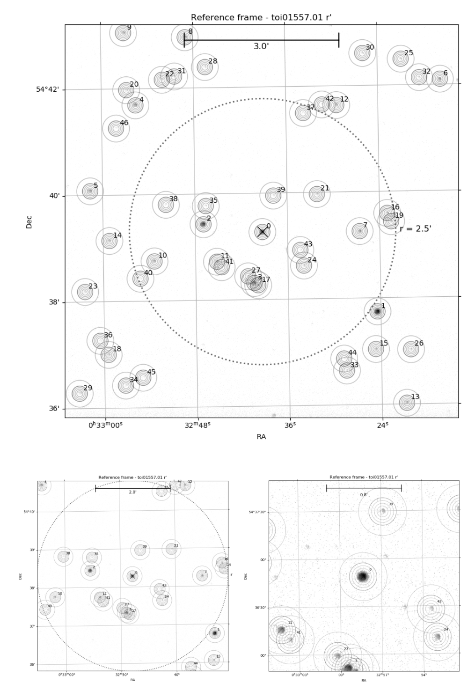
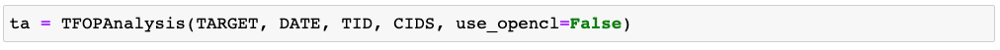
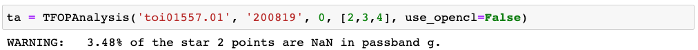
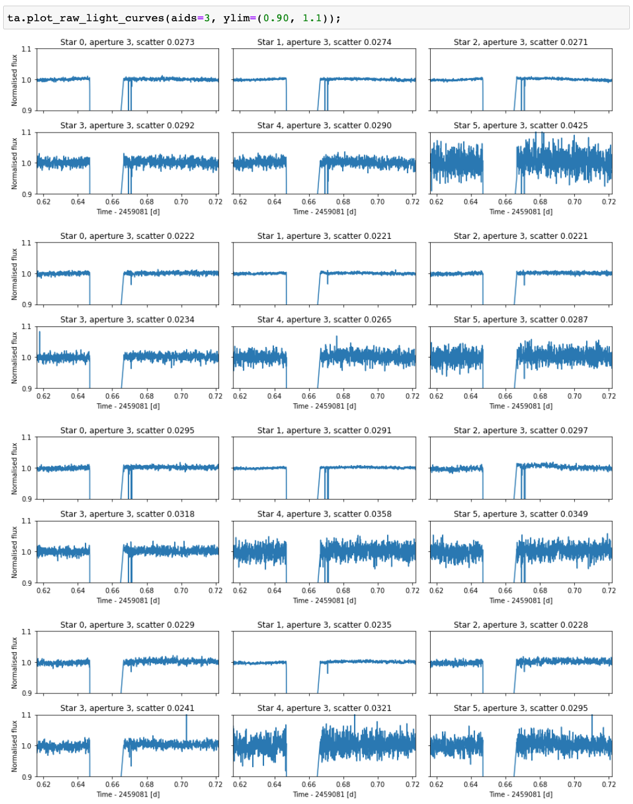
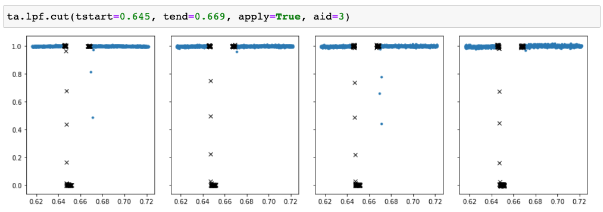
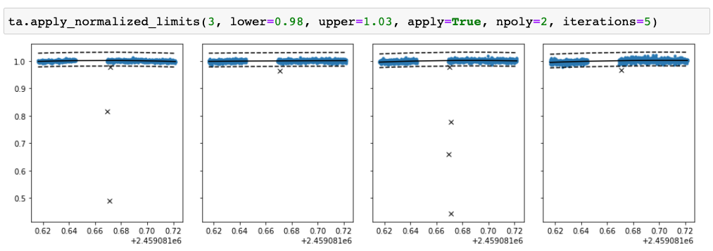

Full analysis
-------------

The full analysis (with transit fitting) carries out the steps required for ExoFOP submission and
creates reduced light curves in fits-format that can be used in subsequent analyses (or shared with
collaborators).

Field overview
**************

After opening the notebook template you've created, you should see an example MuSCAT2 frame with
apertures, sky annuli, and star IDs plotted together with a 2.5 arcmin circle centered around the target
star (if the astrometry worked for the field). If you're using a older version of the MuSCAT2 pipeline
you'll see just the full frame, but a newer version plots also a 5 and 2 arcmin-wide versions.

The concentric circles show the apertures used to calculate the photometry for each star. The apertures
are accessed by the aperture index (``aid``) that is 0 for the innermost aperture. The outermost aperture
can always be accessed as ``-1``.

Before continuing, make sure that all the stars near the target star has been included into the photometry.
That is, that all the black blobs are surrounded with apertures. If not, write to Hannu (or anyone else who knows
how to run the photometry pipeline) that the photometry needs to be redone for the target.

TFOPAnalysis initialisation
***************************

The TFOP analysis is done with the ``muscat2ta.tfopanalysis.TFOPAnalysis`` class that contains all the necessary methods
for the TFOP data reduction and analysis.

``TFOPAnalysis`` is initialised as

where

 - ``TARGET`` is target name exactly as in the MuSCAT2 catalog
 - ``DATE`` is the observing date in the format ``yymmdd``
 - ``TID`` is the target ID. This should be 0 if we have an astrometric solution for the field, but can be something
   else if astrometry has failed for any reason. Please check the reference frames against the field
   shown for the target in the MuSCAT2 observation database.
 - ``CIDS`` is a list of IDs of the useful comparison stars to include into the comparison star optimisation.
   *Note:* The final set of comparison stars will be a subset of these stars. The analysis is relatively
   robust against bad comparison stars, but each comparison star adds free parameters to the optimisation,
   so it's best to constrain this to a small number of good comparison stars.

``TFOPAnalysis`` has a set of optional arguments that can be used to fine-tune the analysis

 - ``passbands ['g','r','i','z_s']``: passbands to include into the analysis.
 - ``aperture_limits [(0, inf)]``: a (min, max) tuple of aperture ID limits for the aperture optimisation.
 - ``use_opencl [False]``: use OpenCL (some parts of the computations will be done with the GPU) if ``True``.
 - ``with_transit [True]``: include a transit model into the light curve model if ``True``.
 - ``contamination [None]``: allow the flux to be contaminated by an unresolved star if ``True``.
 - ``radius_ratio ['achromatic']``: ``chromatic`` for passband dependent radius ratios and ``achromatic`` for passband independent radius ratios.
 - ``npop [200]``: number of parameter vectors in the optimisation and MCMC.
 - ``toi [None]``: ``TOI`` object with the ExoFOP TOI information.

The pipeline prefills the ``TARGET``, ``DATE``, and ``TID`` arguments, but you'll need to choose the comparison stars. The comparison
stars should be bright but not saturated, not blended with other stars of similar brightness, and without any intrinsic variability.

Continuing this example, we initialise the anaysis as

where we are warned that some of the star 2 points are saturated. We generally avoid including comparison stars with saturated points,
but here the count is small enough to include star 2.

Light curve cleanup
*******************

The first step is to look at the raw data, because this can already show any major issues with the observations (clouds, for example).
This is done with the ``TFOPAnalysis.plot_raw_light_curves`` method after the ``TFOPAnalysis`` has been initialised. By default, the
method plots the raw light curve for the target and five brightest stars for all passbands, but the plotted stars, apertures, and
everything else can be modified using the optional method arguments.

The raw light curves for our example case show that something weird happens around one thirds to the observations. All the fluxes drop
to zero for some time (could be a cloud or a dome failure), and we do not want to include this data to our analysis. We can use the
``TFOPAnalysis.cut`` method to remove a section of the light curve

where the ``tstart`` and ``tend`` are given relative to the start of the night, as shown in the raw flux plot. We can also remove all
the points up to time ``t`` by setting ``tstart=-inf, tend=t``, or all the points after time ``t`` by setting ``tstart=t, tend=inf``.
The section to be removed can be visualised by setting ``apply=false``, in which case the method creates a plot but does not touch
the data, and multiple sections can be removed from the data by calling the method multiple times with different parameters.

Next, we can remove outliers using ``TFOPAnalysis.apply_normalised_limits`` (the method name may change soon...). The method fits a
polynomial to the normalised light curve and allows one to remove the points below a lower limit or above an upper limit.

Finally, we can bin the observations in time using the ``TFOPAnalysis.downsample`` method. While binning should be avoided in many
science cases, for TFOP analyses we can generally bin to 60 seconds without any loss in information.

Creating the ExoFOP output
**************************

The possible blends are plotted using ``TFOPAnalysis.plot_possible_blends`` method:

.. code-block:: python

    ta.plot_possible_blends(cid=CID, aid=AID, caid=CAID)

where ``CID`` is a comparison star ID that should correspond to a bright (but not saturated) star outside of the 2 arcmin
circle, ``AID`` is the aperture index to use for the blending calculation, and ``CAID`` is the (optional) comparison star
aperture index that can be set if the comparison star is much brighter than the possible sources of blends.

Transit modelling
*****************

Wrapping up the analysis
************************

The analysis is finished by calling the three ``TFOPAnalysis`` methods

.. code-block:: python

    ta.save()
    ta.save_fits()
    ta.finalize()

The first one saves the optimisation result and the MCMC samples, the second one saves the reduced light curves in fits format,
and the last one copies all the necessary files to the ``submit`` directory, including a partially filled **report.txt** file
that contains the final report that will be included into the ExoFOP submission.

**After finishing the notebook, make sure you fill the report file.** The analysis code prefills most of the required information,
but not the final analysis conclusions. These should clearly state whether a transit signal occurs on the target and if
the fitted transit signal shows significant chromatic variability. Also include any note you believe
can be useful for people reading the report in ExoFOP and trying to decide if the observations show
support for a planet transit or something else.
